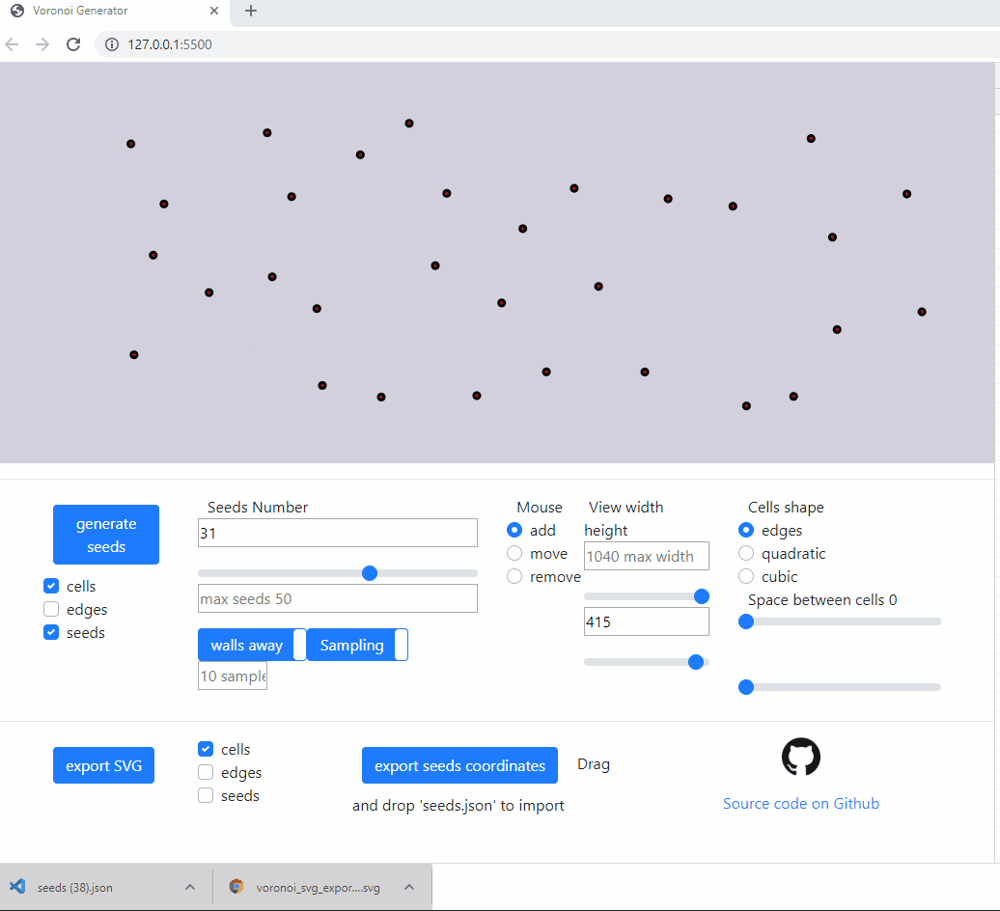

# voronoi
Parametric Voronoi generator with real time editing and SVG export

# Live demo
https://websvg.github.io/voronoi/

# Gif Demo



We see above the user generating seeds, acting on the input range slider to update the number of seeds in real time, modifying the space between cells, changing the cells type, exporting an SVG file then dropping it on a new browser window, exporting seeds file and dropping it on the seeds area to import it

# Features
* Generate Voronoi Diagram
* Export to SVG file
  ## seeds
* Edit seeds : add, move, remove
* Export and import seeds (drag and drop seeds.json) and continue editing of an existing seeds set
* Parametric Seeds generation
  * Controlled seeds spread regularity with multiple sampling and keeping best candidate (farthest from neighbors)
  * Optionally include distance from walls to the sampling selection cost
* Range slider with interactive update for adding and removing seeds to and out of existing set
  ## cells
* different cells types
  * bezier quadratic
  * bezier cubic
  * simple geometric edges
* cells edges retraction. Not cells scale but edges parallel rertraction with handling of closed edges discard
  ## gui
* Show/hide (cells, edges, seeds) and independently configure the SVG export
* Browser local storage of config parameters (No storage of SVG nor seeds as they can be saved separately)

# Planned features
* Shaped tesslation area
  * sampling points and check if point inside SVG with `document.elementFromPoint(x, y);`
* edeg cells filet effect
* detract quadratic bezier short edges
* edit seed weight (? requires a new engine)
* add irregularities to the edges thickness (randomize retraction)
* rearrange the cells when expanding the window

# Dev User Guide
## cells retraction


* The cells are not scaled down, their edges are rather retracted in parallel to their original location.
* When retracting cells as a consequence some edges could become irrelevant and the shape might decrese in edges number.


* Above is another example where we see in debug mode the translated edges and the discarded one is red

## cubic bezier minimum edge size


* goal is to filter small edge to avoid sharp bezier curves
* the quadratic bezier only has one control point, so using the center of the removed edge would still break the tangency alignment with the previous curve
* clean way would require ignoring the corresponding site completely and extend the left edges till the small edge is nullified, thus reducing the total number of sides of the cell
* therfore, in order to keep shapes tangent to the sides, min edge ignore is only implemented in quadratic bezier.

# License
MIT

## Issues
https://github.com/WebSVG/voronoi/issues

# Dependencies

## Vornoi js Library

* 'gorhill' Javascript Voronoi library
  * [github repo](https://github.com/gorhill/Javascript-Voronoi)
  * [live demo](http://www.raymondhill.net/voronoi/rhill-voronoi.html)
  * used `rhill-voronoi-core.js` from commit 3fe2165

## Vector module from matter.js
* modified `./node_modules/matter-js/src/geometry/Vector.js` for ES2015 module import

## bootstrap
* https://getbootstrap.com/docs/4.4/getting-started/introduction/
* https://gitbrent.github.io/bootstrap4-toggle/
* issue with bootstrap toggle adding event listeners with js not possible

## Export / Download
* Filesaver

```
  npm install file-saver --save
  file-saver@2.0.2
```
* to be replaced with 'a' download attribute : https://www.w3schools.com/tags/att_a_download.asp

# References

## js voronoi SVG
* 'stg' voronoi SVG vectorisation : 
  * also baed on [gorhill](https://github.com/gorhill/Javascript-Voronoi)'s library
  * [github stg repo](https://github.com/stg/SVoronoiG)
  * [forked added live demo](https://websvg.github.io/svg_voronoi_gen/)
* http://alexbeutel.com/webgl/voronoi.html
* http://cfbrasz.github.io/VoronoiColoring.html
* https://www.jasondavies.com/maps/voronoi/

## lines intersection
* [wikipedia - lines intersection](https://en.wikipedia.org/wiki/Line%E2%80%93line_intersection)


