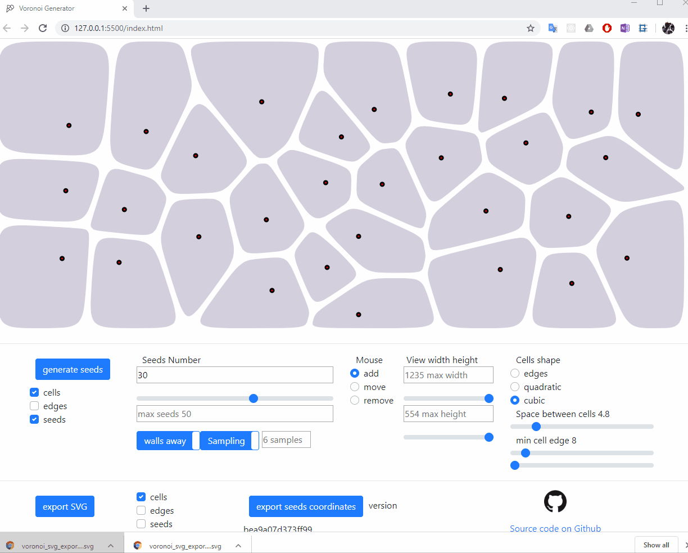
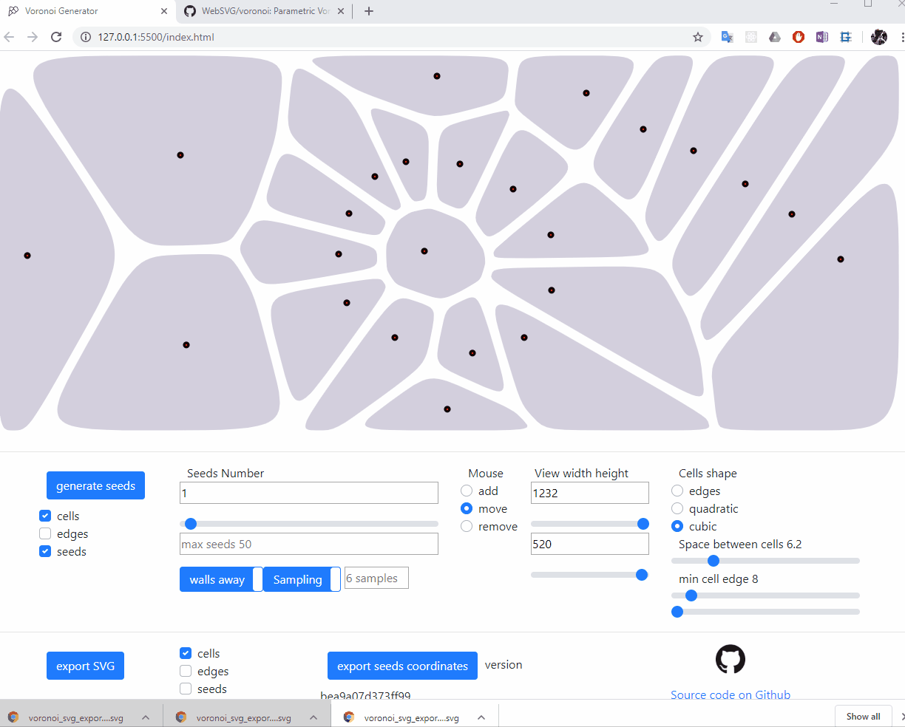
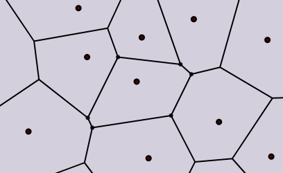
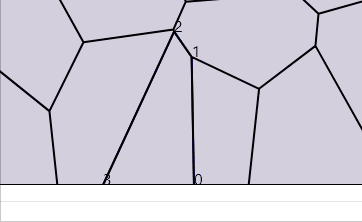
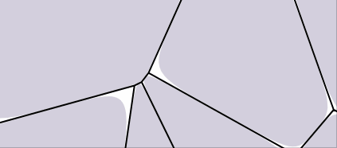
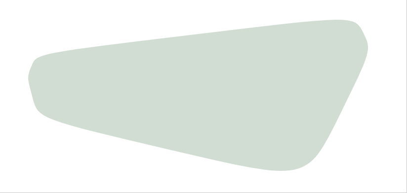
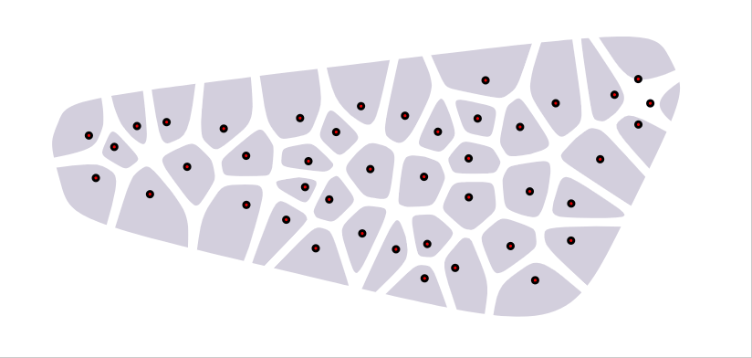
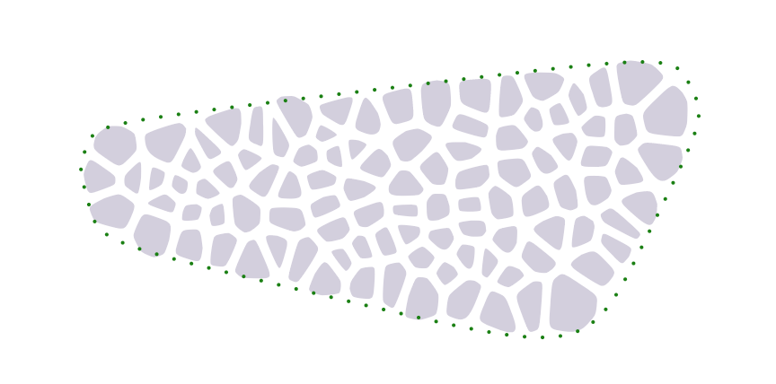
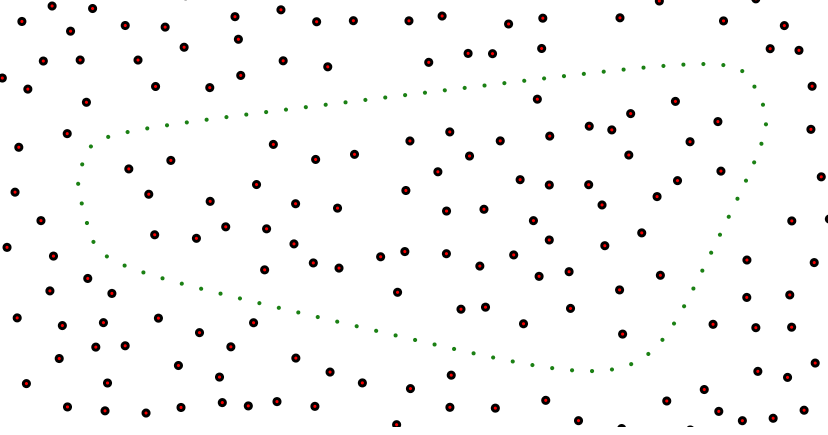

# Description
Parametric Voronoi generator with real time editing and SVG export

# Voronoi editor webiste
Live demo of this repository https://websvg.github.io/voronoi/

# User Guide

## Overview
* Generate Diagram
* Edit cells
* Export SVG



We see above the user generating new sets of seeds with their resulting voronoi diagram, hiding and viewing seeds, cells and edges, changing the number of seeds with a slider while the view updates in real time, editing the cells by moving them, removing and adding cells, changing the cells shape to quadratic bezier, simple edges and back to cubic bezier, finally adjusting the space between cells before exporting in an SVG file.

## Export seeds coordinates
The seeds coordinates are what allows to generate again the same voronoig diagram



* seeds can be exported as a json text file containing each seed coordinate
* the `seeds.json` can be imported by drag and drop on the view area
* it is possible therefore to share seeds structures and continue working on a seeds set at any point in time

## cells retraction
* The cells are not scaled down, their edges are rather retracted in parallel to their original location.
* When retracting cells as a consequence some edges could become irrelevant and the shape might decrese in edges number.



* Below is another example where we see in debug mode the translated edges and the discarded one is red



## cubic bezier minimum edge size


* goal is to filter small edge to avoid sharp bezier curves
* the quadratic bezier only has one control point, so using the center of the removed edge would still break the tangency alignment with the previous curve
* clean way would require ignoring the corresponding site completely and extend the left edges till the small edge is nullified, thus reducing the total number of sides of the cell
* therfore, in order to keep shapes tangent to the sides, min edge ignore is only implemented in quadratic bezier.

## Shaped tesselation area
### step 1 : sampling
the shape is approximated with a set of linear interpolation points along the path


## step 2 : cells isolation 
### the naive (and not so nice) way
```javascript
    <defs>
        <clipPath id="cut-off-cells">
            <path xmlns="http://www.w3.org/2000/svg" d=${path} fill="#991155" fill-opacity="0.9"></path>
        </clipPath>
    </defs>

```
this applies an svg mask, with the SVG `clipPath` function, it would result in this


* First issue, Fusion360 as example does not support `clipPath`
* Second issue, the cut is very sharp and breaks the bezier shape of the cells

### the nicer way


Before explaining how this works, let's inspect that the voronoi cells are natually alligned along the custom path we provided as input

Below is the revealed secret. There are seeds actually being sampled outside the path area for the sole purpose of giving support to the inside cells not to expand till the external frame. Also important that the cells are not just simply randomly sampled inside and outside the area, they are rather avoiding the path with a distance cost factor, that prevents cells from cutting the edges to a certain extent.




# Menu commands
## Seeds generation
* button "generate seeds" : cleans all seeds array and start generating a new sample set.
* checkbox group "cells", "edges", "seeds" : display or hide on the monitor window, each of the cells , their edges, and the seeds.
* input "Seeds Number" : The total number seeds to be visible on the diagram

# Features details
* Generate Voronoi Diagram
* Export to SVG file
  ## seeds
* Edit seeds : add, move, remove
* Export and import seeds (drag and drop seeds.json) and continue editing of an existing seeds set
* Parametric Seeds generation
  * Controlled seeds spread regularity with multiple sampling and keeping best candidate (farthest from neighbors)
  * Optionally include distance from walls to the sampling selection cost
* Range slider with interactive update for adding and removing seeds to and out of existing set
* rearrange seeds when modifying window size
* Shaped tesselation area
  * sampling points inside an SVG path with `document.elementFromPoint(x, y);`

  ## cells
* different cells types
  * bezier quadratic
  * bezier cubic
  * simple geometric edges
* cells edges retraction. Not cells scale but edges parallel rertraction with handling of closed edges discard
* Shaped tesselation area
  * display of cells which seeds are within an SVG path
  * the option is available to simply cut cells with an SVG mask
  ## gui
* Show/hide (cells, edges, seeds) and independently configure the SVG export
* Browser local storage of config parameters (No storage of SVG nor seeds as they can be saved separately)

# Planned features
* vertical mode for longitudinal edits
* export scale with a ratio (adjusting to a given unit)
  * transform scale possible but Fusion360 ignores the scale transform
* Concentration cost map for seeds sampling
* edges cells filet effect
* detract quadratic bezier short edges
* edit seed weight to modify cells size (? requires a new engine, or use cells retraction technique)
  * editing singe seed weight
  * cartographic seeds weight
* add irregularities to the edges thickness (randomize retraction)
* improve error alerts by using boostrap auto vanishing alerts
* random colors for cells

# License
MIT

# Issues
https://github.com/WebSVG/voronoi/issues

# Dependencies

node dependencies are not required to serve the project locally, but only to reference the used dependencies

## Vornoi js Library

* 'gorhill' Javascript Voronoi library
  * [github repo](https://github.com/gorhill/Javascript-Voronoi)
  * [live demo](http://www.raymondhill.net/voronoi/rhill-voronoi.html)
  * used `rhill-voronoi-core.js` from commit 3fe2165
  * modified for ES2015 module import

## Vector module from matter.js
* modified `./node_modules/matter-js/src/geometry/Vector.js` for ES2015 module import

## bootstrap
* https://getbootstrap.com/docs/4.4/getting-started/introduction/
* https://gitbrent.github.io/bootstrap4-toggle/
* issue with bootstrap toggle adding event listeners with js not possible

## Export / Download
* Filesaver

```
  npm install file-saver --save
  file-saver@2.0.2
```
* to be replaced with 'a' download attribute : https://www.w3schools.com/tags/att_a_download.asp

# References
* 'stg' voronoi SVG vectorisation : 
  * also baed on [gorhill](https://github.com/gorhill/Javascript-Voronoi)'s library
  * [github stg repo](https://github.com/stg/SVoronoiG)
  * [forked added live demo](https://websvg.github.io/svg_voronoi_gen/)
* http://alexbeutel.com/webgl/voronoi.html
* http://cfbrasz.github.io/VoronoiColoring.html
* https://www.jasondavies.com/maps/voronoi/
* [wikipedia - lines intersection](https://en.wikipedia.org/wiki/Line%E2%80%93line_intersection)


* Bezier curves https://pomax.github.io/bezierinfo/
* Closest point on path approximation : https://bl.ocks.org/mbostock/8027637

