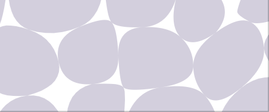

# voronoi
Parametric Voronoi generator with real time editing and SVG export

# Live demo
https://websvg.github.io/voronoi/

# Features
* Generate Voronoi
* Export Vornoi to SVG
* Edit seeds : add, move, remove
* Export and import seeds (drag and drop seeds.json) and continue editing of an existing seeds set
* bezier cells (quadratic curves)
* Parametric Seeds generation
  * Controlled seeds spread regularity with multiple sampling and keeping best candidate (farthest from neighbors)
  * Optionally include distance from walls to the sampling selection cost
* Range slider with interactive update for adding and removing seeds to and out of existing set
* Show/hide (cells, edges, seeds) and independently configure the SVG export
* Browser local storage of config parameters (Not SVG, not seeds as they can be saved separately)
* voronoi icon

# Planned features
* Shaped tesslation area
* geometric cells with variable size and filet effect
* bezier cells option
  * variable cell edges thickness (cell edge move to center)
  * variable bezier curve (cubic bezier curve with variable control points length)
* optionally remove pointy edges of bezier cells (ignore short edges)
* edit seed weight

# Minimal cells edge size


* goal is to filter small edge to avoid ugly bezier edgy effect
* ignoring an edge poses the issue of which vertex to use as control point for the left edges
* using the center of the removed edge as new control point would break the tangency alignment with the previous curve
* clean way would require ignoring the corresponding site completely and extend the left edges till the small edge is nullified, thus reducing the total number of sides of the cell
* cell sides expansion only works for bezier cells not for geometric cell
* therefore, the min edge size filtering is currently disabled until proper small edges expansion is implemented

# SVG path tesslation area
* sampling points and check if point inside SVG with `document.elementFromPoint(x, y);`

## Known Issues
* tesslation size does not cover the full height
* edit checkboxes not persisted

# License
MIT

# Dependencies

## Vornoi js Library

* 'gorhill' Javascript Voronoi library
  * [github repo](https://github.com/gorhill/Javascript-Voronoi)
  * [live demo](http://www.raymondhill.net/voronoi/rhill-voronoi.html)
  * used `rhill-voronoi-core.js` from commit 3fe2165

## Vector module from matter.js
* modified `./node_modules/matter-js/src/geometry/Vector.js` for ES2015 module import

## bootstrap
* https://getbootstrap.com/docs/4.4/getting-started/introduction/
* https://gitbrent.github.io/bootstrap4-toggle/
* issue with bootstrap toggle adding event listeners with js not possible

## Export / Download
* Filesaver

```
  npm install file-saver --save
  file-saver@2.0.2
```
* to be replaced with 'a' download attribute : https://www.w3schools.com/tags/att_a_download.asp

# References

## js voronoi SVG
* 'stg' voronoi SVG vectorisation : 
  * also baed on [gorhill](https://github.com/gorhill/Javascript-Voronoi)'s library
  * [github stg repo](https://github.com/stg/SVoronoiG)
  * [forked added live demo](https://websvg.github.io/svg_voronoi_gen/)
* http://alexbeutel.com/webgl/voronoi.html
* http://cfbrasz.github.io/VoronoiColoring.html
* https://www.jasondavies.com/maps/voronoi/

## lines intersection
* https://en.wikipedia.org/wiki/Line%E2%80%93line_intersection

